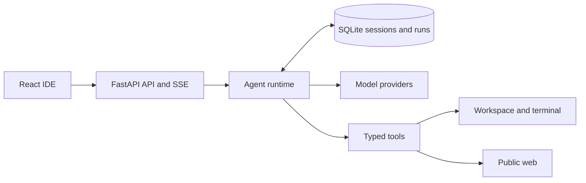

# Agent harness architecture

VexP Code uses one bounded run coordinator instead of a chain of planner, reviewer, and executor models. The coordinator owns run state, context limits, model routing, tool execution, recovery, and the final response.

## Runtime ownership

| Module | Responsibility |
|---|---|
| `backend/agent_runtime.py` | Bounded model/tool loop, cancellation, approvals, checkpoints, recovery, and finalization |
| `backend/providers.py` | OpenAI-compatible, Anthropic, Ollama, and free-cloud streaming adapters; route selection and model pinning |
| `backend/model_catalog.py` | Curated Fast reply and Complex work model catalog |
| `backend/tools.py` | Validated workspace files, terminal, Git, web-search, and page-reading tools |
| `backend/storage.py` | SQLite sessions, messages, run records, events, memories, and checkpoints |
| `backend/server.py` | Authenticated HTTP/SSE API, settings, workspace, terminal, Git, and GitHub endpoints |

## Run contract

1. The API records the run and persists the user request before inference starts.
2. The runtime builds token-bounded context from recent messages, selected files, attachments, and an active-task ledger.
3. An automatic route resolves one eligible provider/model and pins it for the run. Tool-capable runs exclude answer-only providers.
4. The model may return typed tool calls. The runtime validates schema, access policy, workspace paths, and remaining limits before execution.
5. Every tool result, approval, route choice, and checkpoint is persisted and streamed to the UI.
6. Complex work reserves a final tool-free model turn so a tool, time, or turn limit produces a readable result instead of stopping mid-response.
7. Failed or interrupted work retains its checkpoint so a later request can continue from the recorded objective and actions.

## Access and research boundaries

Workspace file operations remain confined to the active workspace. Terminal access has three user-selected policies:

- **Ask commands**: request approval for every command, then run with the desktop user's normal device and network access.
- **Workspace access**: run automatically in the Linux workspace sandbox without network access.
- **Whole device access**: run automatically with the desktop user's normal filesystem and network access.

Web Auto supplies bounded public search and page-reading tools when fresh information is needed. Explicit research and software availability or installation questions are searched before the first answer. The runtime corrects unsupported claims that web or device access is unavailable when the selected policy permits it.

## Verification

The coordinator records observed checks and workspace diffs; it does not claim that checks ran without evidence. The contract suite in `tests/` covers routing, tool-call shape, permissions, cancellation, persistence, workspace boundaries, and web safety.
